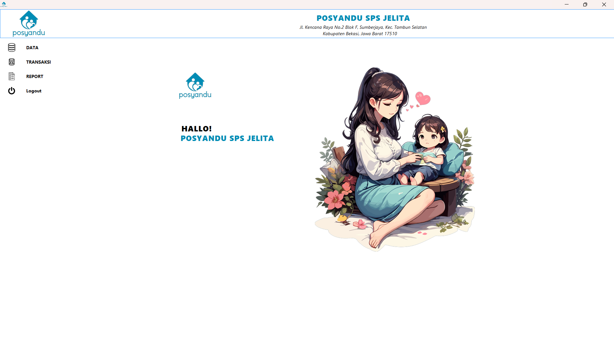
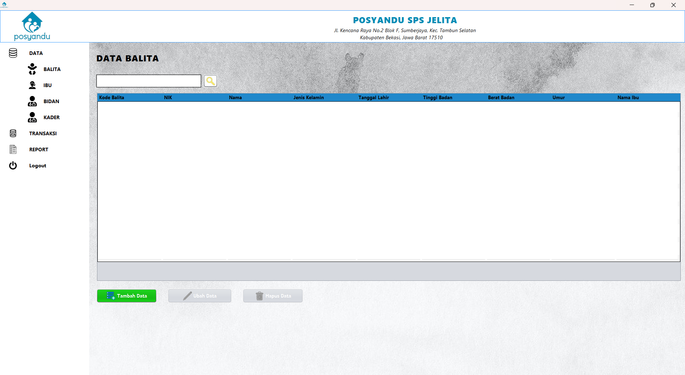
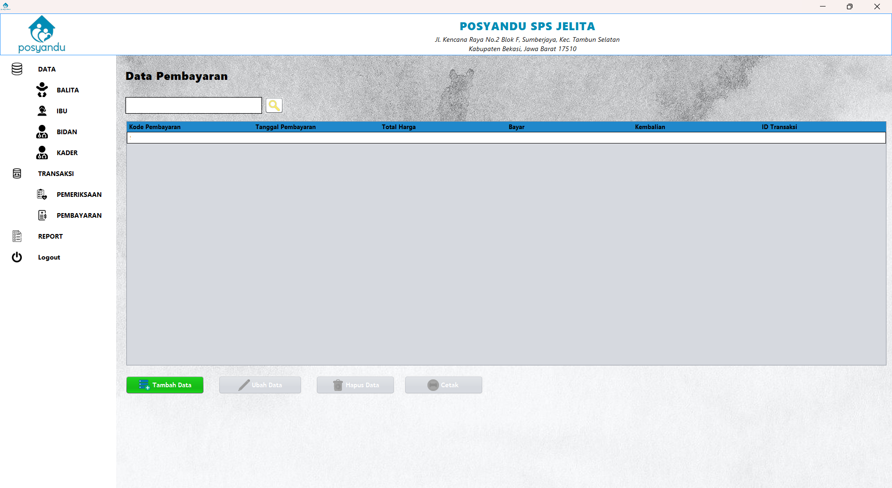
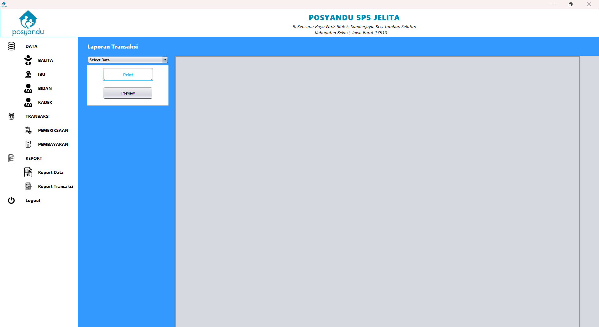

# Administrasi Posyandu - Project Kuliah Kerja Praktik

Ini adalah proyek aplikasi administrasi sederhana yang dikembangkan sebagai bagian dari Tugas Kuliah Kerja Praktik.

## Teknologi 

Website ini dikembangkan menggunakan teknologi berikut:

- Java dan MySql.

## Pengembang 

- Adriansyah Syaputra
- Yabsir Aditya
- Andhika Meidzak Prawibowo
- Robby Kusuma
- Seto Bagas Satrio
- Shintia Fortuna

## Tampilan
- ### Login

- ### Dashboard

- ### Master Data

- ### Transaksi

- ### Laporan

